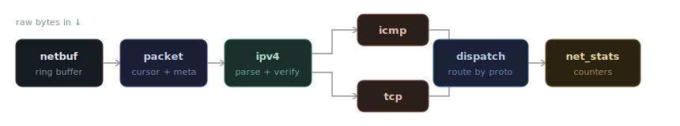
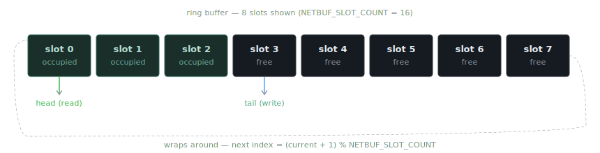
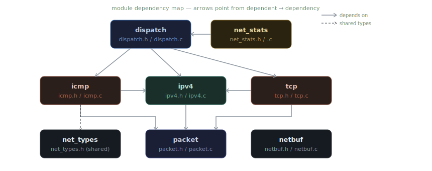

# 🌐 net-ingress

**A clean, OS-oriented network ingress subsystem written in C**

Welcome to **net-ingress**.  
This project explores one simple but powerful question:

> *What actually happens to network data when it first enters an operating system?*

Then:

> *Can kernel-level packet ingress be designed with provable memory and determinism guarantees?*

Not at the application level.  
Not inside a full TCP/IP stack.  
But **right at the boundary where raw bytes become meaningful packets**.

This repository exists to make that boundary visible, understandable, and teachable.

---

## ✨ Why this project exists

Most networking projects jump straight to sockets, APIs, or full protocol stacks.  
Most OS projects skip networking entirely or treat it as magic.

**net-ingress sits in between.**

It focuses on the *earliest stages of networking inside an OS*:

- How incoming data is **buffered safely**
- How packets are **represented in memory**
- How protocol headers are **parsed, not guessed**
- How packets are **dispatched internally**
- How system behavior is **observed, not assumed**

The goal is not “more features”.  
The goal is **clear thinking and clean structure**.

---

## 🧠 How to think about this project

Imagine a real operating system.

Before applications see anything, before sockets exist, before TCP state machines run, the OS must answer very basic questions:

- Where do I store incoming data?
- How do I avoid memory chaos?
- How do I tell one protocol from another?
- How do I route packets internally?
- How do I know when things go wrong?

This project answers those questions **step by step**, using plain C and OS-friendly design.

---

## 🧩 What this project is (and is not)

### ✅ What it *is*
- A **network ingress subsystem**
- Deterministic and fixed-memory
- Suitable for kernels, teaching OSes, and experiments
- Designed to be read, extended, and reasoned about
- Fully testable without hardware

### ❌ What it is *not*
- A full TCP/IP stack
- A NIC driver
- A user-space networking library
- A performance-optimized production system

Those layers come later. This is the foundation they stand on.

---

## 🏗️ Architecture

### Ingress pipeline

Each stage is isolated, explicit, and intentional. Nothing happens "by accident".



| Stage | Module | Role |
|---|---|---|
| 1 | `netbuf` | Fixed-size ring buffer that holds raw incoming bytes |
| 2 | `packet` | Lightweight cursor over raw bytes — tracks parse position |
| 3 | `ipv4` | Parses and validates the IPv4 header; identifies protocol |
| 4 | `icmp` / `tcp` | Protocol-specific header parsers |
| 5 | `dispatch` | Routes each packet to the correct handler via a function-pointer table |
| 6 | `net_stats` | Accumulates counters for every observable event |

### Ring buffer (`netbuf`)

Incoming bytes land in a fixed-size circular buffer. No dynamic allocation — ever.



The producer (hardware/NIC) writes at `tail`; the consumer (parser) reads from `head`. When the buffer is full, new packets are rejected and counted — never silently dropped.

### Module dependencies



---
---

## 📁 Repository structure

```
net-ingress/
├── include/ # Public interfaces (as if used by a kernel)
├── src/ # Internal implementations
├── tests/ # Hardware-independent tests
├── docs/ # Architecture notes and learning material
```

If you are learning:
- Start with `docs/`
- Then read `include/`
- Then explore `src/`

That order matters.

---

## 🎓 Who this is for

- Students learning **Operating Systems**
- Learners curious about **network internals**
- Educators designing **systems labs**
- Developers building **small or experimental kernels**
- Anyone who wants to understand networking *without black boxes*

You do **not** need prior kernel experience.  
You do need curiosity and patience.

---

## 🛠️ Design principles (read this once, remember forever)

- **No dynamic memory allocation**  
  Predictability beats convenience in system software.

- **Clear separation of concerns**  
  Buffering is not parsing. Parsing is not dispatch.

- **Structure over cleverness**  
  Simple code that explains itself is preferred.

- **Measure, don’t assume**  
  Statistics are part of the design, not an afterthought.

---

## ✅ Project status

The subsystem is complete and fully tested.

- All 6 modules implemented: `netbuf`, `packet`, `ipv4`, `icmp`, `tcp`, `dispatch`, `net_stats`
- 187 hardware-independent tests pass with zero warnings (`-Wall -Wextra -Wpedantic`)
- Build with `make` — run tests with `make test`

Design decisions are documented alongside code to preserve *why*, not just *what*.

---

## 📜 License

Released under the **MIT License**.  
You are free to learn from it, use it, modify it, and teach with it.

---

## 🌱 Final note

This repository is intentionally calm.

No buzzwords.  
No exaggerated claims.  
Just one carefully designed subsystem, explained clearly.

If this project helps you understand even one concept more deeply, it has done its job.
